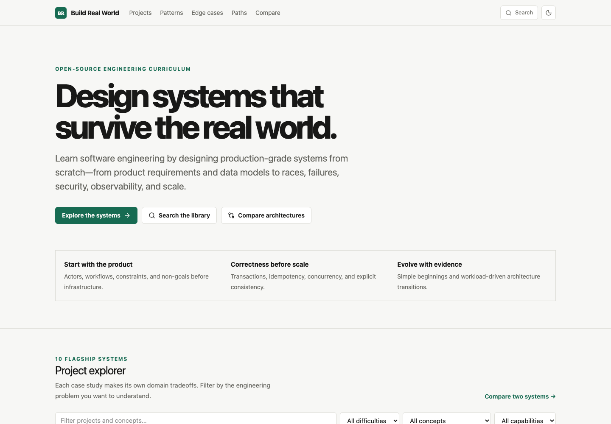

# Build Real World

**Learn software engineering by designing production-grade systems from scratch.**

[](https://github.com/rahmankutlu/build-real-world/actions/workflows/ci.yml)
[](LICENSE)
[](LICENSE)



**Live demo:** https://build-real-world.dev _(placeholder until the first deployment)_

Build Real World is an open-source, static-first knowledge platform for learning how real products are designed. It follows each system from users and workflows through data, APIs, transactions, asynchronous work, failure recovery, security, observability, testing, deployment, and evidence-driven scaling.

It is not a clone tutorial, an interview cheat sheet, or a gallery of unexplained architecture boxes.

## Featured projects

- [E-commerce Platform](content/projects/ecommerce/) — stock reservation, checkout, fulfillment, and returns
- [Food Delivery Platform](content/projects/food-delivery/) — merchant acceptance, dispatch, geospatial state, and settlement
- [Ride Hailing Platform](content/projects/ride-hailing/) — driver matching, location churn, and acceptance races
- [Video Streaming Platform](content/projects/video-streaming/) — resumable ingest, transcode pipelines, immutable media, and CDN delivery
- [Payment Platform](content/projects/payment-platform/) — safe provider orchestration, idempotency, ledger concepts, and reconciliation

## Why this exists

Software architecture is not the act of drawing services. It is the process of turning product constraints into boundaries that remain understandable when requests race, providers time out, queues redeliver, permissions change, and workloads grow.

Each case study answers the same core questions while preserving what is different about its domain:

- What are we building, for whom, and what is deliberately out of scope?
- Which invariants require a transaction, constraint, version, or lock?
- Which results may converge asynchronously?
- How do retries, duplicate messages, stale caches, and partial failures behave?
- What are the authorization and privacy boundaries?
- Which logs, metrics, traces, alerts, and tests demonstrate that it works?
- How can the architecture evolve from a small deployment without inventing scale?

## The v0.1 project set

| Project | Difficulty | Distinctive engineering concerns |
| --- | --- | --- |
| E-commerce Platform | Advanced | inventory, transactional checkout, fulfillment |
| Food Delivery Platform | Expert | menu volatility, courier dispatch, live delivery |
| Ride Hailing Platform | Expert | matching races, location streams, trip ownership |
| Hotel PMS | Advanced | nightly inventory, folios, business date, tenant isolation |
| Appointment SaaS | Intermediate | recurrence, holds, time zones, calendar convergence |
| Project Management Platform | Advanced | optimistic collaboration, ACLs, activity fan-out |
| Video Streaming Platform | Expert | media pipelines, immutable objects, CDN delivery |
| Social Network | Expert | hybrid feed fan-out, graph privacy, moderation |
| Cloud File Storage | Advanced | resumable upload, namespace/ACLs, scanning, quota |
| Payment Platform | Expert | provider ambiguity, idempotency, ledger, reconciliation |

Every project includes product and functional requirements, roles, workflows, a domain model, focused PostgreSQL schema, resource-oriented APIs, relevant events, at least five failure modes, consistency and concurrency decisions, caching, jobs, security, observability, tests, deployment stages, workload-scenario evolution, and three Mermaid diagrams.

## Engineering library

The platform currently contains:

- 17 pattern guides, including idempotency keys, outbox, sagas, locking, retries, caching, webhooks, pagination, multi-tenancy, jobs, and audit logs.
- 30 edge cases organized across payments, booking, authentication, uploads, realtime, messaging, notifications, inventory, tenancy, time zones, and distributed systems.
- Four learning paths for backend foundations, distributed systems, realtime systems, and SaaS architecture.
- Metadata-driven architecture comparison and client-side full-text search.

Complex patterns are not presented as badges of maturity. Every guide states when not to use the pattern and what it costs.

## Local development

Requirements: Node.js 20.9 or newer and npm.

```bash
npm install
npm run dev
```

Open http://localhost:3000.

```bash
npm run lint
npm run typecheck
npm test
npm run validate
npm run build
npx playwright install chromium
npm run test:e2e
```

`next build` produces a static export in `out/`. Set `NEXT_PUBLIC_SITE_URL` to the canonical deployment origin when building for production. For a repository-scoped GitHub Pages site, also set `NEXT_PUBLIC_BASE_PATH=/repository-name`; the included Pages workflow does this automatically.

## Architecture

```text
Version-controlled TypeScript + JSON content
                    │
                    ▼
      Zod schema and reference validation
                    │
                    ▼
       Next.js App Router static generation
          │              │             │
          ▼              ▼             ▼
    Project pages    Search index    Atom/sitemap
          │
          ▼
  Static host / GitHub Pages
```

There is no application backend in v0.1. Mermaid is rendered client-side, while the content and routes are generated at build time. Search and comparison operate on the static corpus in the browser.

## Repository map

```text
app/                 routes, metadata, sitemap, feed
components/          interactive UI and Mermaid renderer
content/projects/    ten structured case studies + metadata
content/patterns/    engineering pattern library
content/edge-cases/  failure field guide
content/learning-paths/
lib/                 schemas and shared types
scripts/             content and link validation
tests/               unit/component tests
e2e/                 Playwright core flows
```

## Contributing

Corrections, deeper failure analysis, schema improvements, diagrams, API examples, translations, edge cases, and well-scoped projects are welcome. Start with [CONTRIBUTING.md](CONTRIBUTING.md). The project template and automated checks exist to keep contributions reviewable and prevent shallow filler.

Do not include proprietary architecture, credentials, production data, unsafe payment handling, or claims that an example is production-certified.

## Roadmap

- **v0.1:** 10 flagship designs, patterns, 30 edge cases, paths, search, comparison, themes, static export, CI
- **v0.2:** 20 projects, interactive database diagrams, deeper comparisons, translation foundation
- **v0.3:** architecture playground, capacity-estimation exercises, failure injection scenarios
- **v0.4:** community implementations, multiple stack examples, interactive quizzes
- **v1.0:** stable content schema and contributor model, 50+ production-grade projects

## License

Source code is licensed under the [MIT License](LICENSE). Educational prose, diagrams, and structured case-study content under `content/` and `docs/` are licensed under [Creative Commons Attribution 4.0 International](LICENSE). Contributions are accepted under the applicable license.
