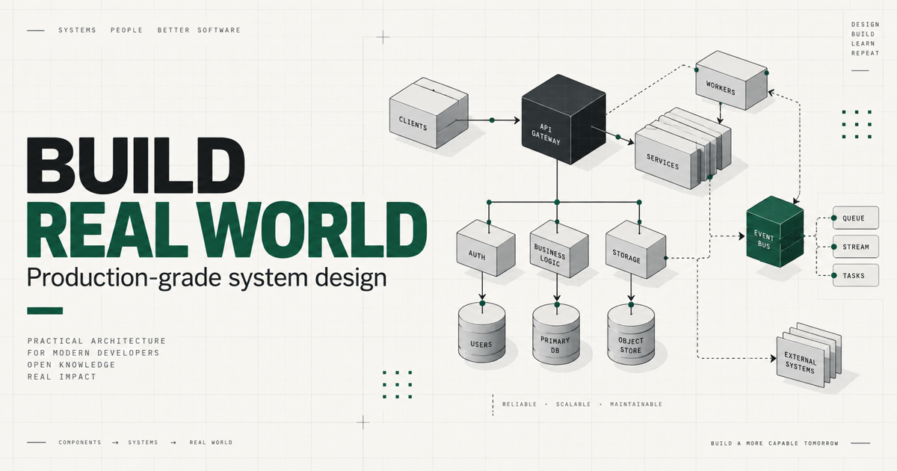
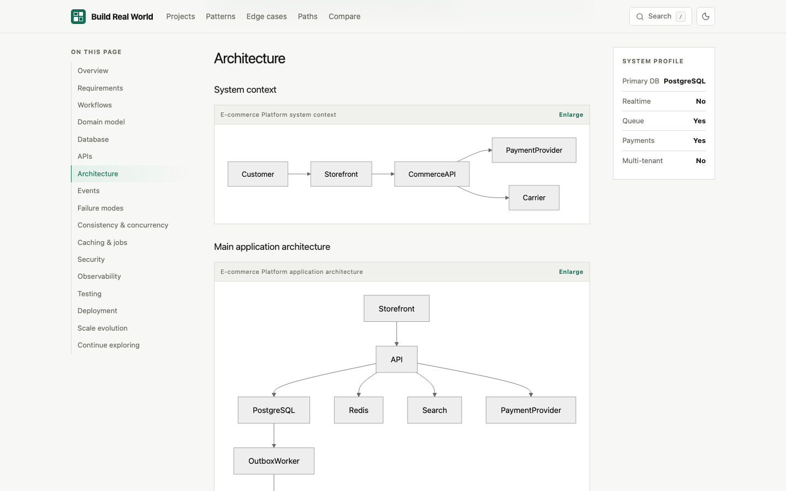

# Build Real World

**Production-grade system design, one real-world product at a time.**

Learn how applications are shaped by transactions, concurrency, failures, queues, caching, authorization, observability, and scale—not just by boxes in an architecture diagram.

[](https://github.com/rahmankutlu/build-real-world/actions/workflows/ci.yml)
[](https://github.com/rahmankutlu/build-real-world/actions/workflows/codeql.yml)
[](https://github.com/rahmankutlu/build-real-world/actions/workflows/pages.yml)
[](https://nextjs.org/)
[](https://www.typescriptlang.org/)
[](LICENSE)
[](LICENSE-CONTENT)

[**Open the live site**](https://rahmankutlu.github.io/build-real-world/) · [**Explore the projects**](https://rahmankutlu.github.io/build-real-world/#projects) · [**Contribute**](CONTRIBUTING.md)

[](https://rahmankutlu.github.io/build-real-world/)

## Why this is different

Build Real World starts with a product and follows the decisions required to keep it correct when requests race, providers time out, messages repeat, permissions change, and workloads grow.

| Typical short-form material | Build Real World |
| --- | --- |
| Happy-path feature walkthrough | Failure modes and recovery behavior |
| CRUD tables | Constraints, invariants, indexes, and transaction boundaries |
| Static architecture snapshot | Evolution from a small deployment to workload-driven partitions |
| Endpoint list | Permissions, idempotency, pagination, and status semantics |
| “Add Redis” | What is safe to cache, what is not, and how it is invalidated |
| “Use a queue” | Producer/consumer ownership, retries, deduplication, and dead letters |

This is not a claim that every example is ready to deploy unchanged. It is a practical reference for learning how product rules become engineering boundaries.

## What is inside

- **10 flagship system designs** covering commerce, logistics, SaaS, media, social, storage, and payments.
- **17 engineering patterns** with use cases, counterexamples, minimal implementations, and tradeoffs.
- **30 edge cases** that explain the failure mechanism, resulting bug, and mitigation.
- **Four learning paths** for backend foundations, distributed systems, realtime systems, and SaaS architecture.
- **Full-text search and architecture comparison** across the static content graph.

Every flagship project includes actors and requirements, domain relationships, a focused relational schema, realistic APIs, event boundaries, concurrency controls, caching, background jobs, security, observability, testing, deployment stages, and three Mermaid diagrams.

## Flagship systems

| Project | Difficulty | Core engineering problems | Key concepts |
| --- | --- | --- | --- |
| [E-commerce Platform](https://rahmankutlu.github.io/build-real-world/projects/ecommerce/) | Advanced | Inventory consistency, checkout, fulfillment | Transactions, locking, idempotency |
| [Food Delivery Platform](https://rahmankutlu.github.io/build-real-world/projects/food-delivery/) | Expert | Menu volatility, courier dispatch, settlement | Geospatial, sagas, WebSockets |
| [Ride Hailing Platform](https://rahmankutlu.github.io/build-real-world/projects/ride-hailing/) | Expert | Matching races, location streams, trip ownership | Realtime, geospatial, concurrency |
| [Hotel PMS](https://rahmankutlu.github.io/build-real-world/projects/hotel-pms/) | Advanced | Nightly inventory, folios, business dates | Multi-tenancy, audit logs, timezones |
| [Appointment SaaS](https://rahmankutlu.github.io/build-real-world/projects/appointment-saas/) | Intermediate | Slot contention, recurrence, calendar drift | Scheduling, webhooks, optimistic locking |
| [Project Management](https://rahmankutlu.github.io/build-real-world/projects/project-management/) | Advanced | Concurrent edits, ACLs, activity fan-out | Authorization, realtime, pagination |
| [Video Streaming](https://rahmankutlu.github.io/build-real-world/projects/video-streaming/) | Expert | Media ingest, processing recovery, delivery | Queues, object storage, CDN |
| [Social Network](https://rahmankutlu.github.io/build-real-world/projects/social-network/) | Expert | Feed fan-out, graph privacy, moderation | Eventual consistency, caching, abuse controls |
| [Cloud File Storage](https://rahmankutlu.github.io/build-real-world/projects/cloud-file-storage/) | Advanced | Resumable uploads, ACLs, quotas, sync | Object storage, background jobs, tenancy |
| [Payment Platform](https://rahmankutlu.github.io/build-real-world/projects/payment-platform/) | Expert | Ambiguous outcomes, refunds, reconciliation | Ledger concepts, webhooks, idempotency |

## See the platform

| Home and project explorer | A case study: architecture section |
| --- | --- |
| [](https://rahmankutlu.github.io/build-real-world/) | [](https://rahmankutlu.github.io/build-real-world/projects/ecommerce/#architecture) |

The web app is static-first: content and routes are generated at build time; search, filters, comparison, theme switching, and Mermaid rendering run in the browser. No account, backend, analytics, or tracker is required.

## Quick start

### Browse online

Open **https://rahmankutlu.github.io/build-real-world/**. A useful first path is [E-commerce Platform](https://rahmankutlu.github.io/build-real-world/projects/ecommerce/) → [Appointment SaaS](https://rahmankutlu.github.io/build-real-world/projects/appointment-saas/) → [Payment Platform](https://rahmankutlu.github.io/build-real-world/projects/payment-platform/).

### Run locally

```bash
git clone https://github.com/rahmankutlu/build-real-world.git
cd build-real-world
npm ci
npm run dev
```

Open http://localhost:3000.

Run the complete local quality gate:

```bash
npm run check
npm run build
npx playwright install chromium
npm run test:e2e
```

Validate the exact GitHub Pages base path:

```bash
npm run build:pages
```

## How the repository works

```text
content metadata + typed case studies
                │
                ▼
   Zod, references, links, SEO checks
                │
                ▼
      Next.js static generation
       │          │          │
       ▼          ▼          ▼
  content pages  search   sitemap/feed
                │
                ▼
   CI: unit, validation, E2E (root + Pages path)
                │  passes on main
                ▼
  GitHub Pages deploys the artifact CI built
```

```text
app/                 routes, metadata, sitemap, feed
components/          interactive UI and Mermaid renderer
content/projects/    ten structured case studies + metadata
content/patterns/    engineering pattern library
content/edge-cases/  failure field guide
content/relationships.ts
lib/                 schemas, URLs, SEO, shared types
scripts/             content, Mermaid, link, SEO, Open Graph, and export validation
tests/               unit and component tests
e2e/                 Playwright browser flows
```

## Contributing

The most valuable contributions are often small and specific: correct an unsafe assumption, add a missing race, improve an index, sharpen a diagram, or explain why a pattern does not belong.

Read [CONTRIBUTING.md](CONTRIBUTING.md) before proposing a flagship system. New projects must meet the same depth and validation requirements as the existing ten; renamed architectures and invented scale claims are not accepted.

## Roadmap

- **v0.1.x:** harden the public platform, content schema, validation, and contributor workflow.
- **v0.2:** deeper comparisons, interactive database diagrams, and a translation foundation.
- **v0.3:** capacity-estimation exercises and failure-injection scenarios.
- **v1.0:** stable content schema and contributor model with a broader reviewed library.

## License

- Application source, validation tooling, and automation: [MIT](LICENSE)
- Educational prose, diagrams, project data, and documentation assets: [CC BY 4.0](LICENSE-CONTENT)

Contributions are accepted under the license that applies to the files being changed. See [CONTRIBUTING.md](CONTRIBUTING.md#licensing-contributions) for details.
